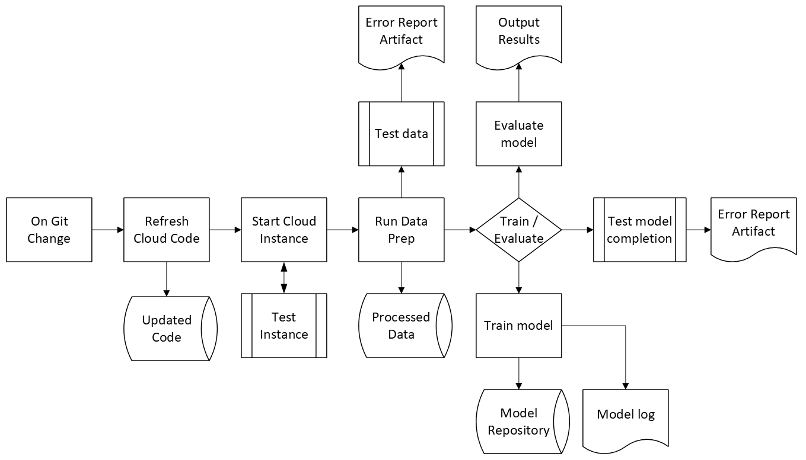

# ML Pipeline

## Table of Contents
- [Workflow](#Workflow)
- [Data prep](#Data_Prep)
- [Training and Evaluating Model](#Train_Eval)
- [Pipeline Testing](#Test_Training_Pipeline)

## Workflow
#### The automated object detection ML workflow initiates on Git updates then:
1. instantiates cloud instance and updates cloud code from repository
2. verifies instance is running
3. initiates data preparation
4. tests that the data exists
5. trains or evaluates either a new model or an existing one
6. tests that the model was created

#### Additional outputs from the automated workflow include:
1. downloaded VOC dataset
2. processed images 
3. model metadata
4. training and evaluation reports
5. trained model dictionary (weights)
6. evaluation images with results per model
7. error report

## Data_Prep
Data prep is mananged in the data_prep.py document
1. requires 2 input arguments
    - training (a text input either "true" or not)
    - save_location (the location for data repository)
2. download VOC dataset from cloud 
    - training and validation dataset if training is "true"
    - testing dataset otherwise
3. if training, preprocesses and standardizes images for deep network
4. outputs from data_prep
    - VOC dataset in save_location if not already there
    - standardized images and metadata in save_location for testing and validation

## Train_Eval
Training and evaluation is a script that automates training and evaluation for object detection
1. requires 5 input arguments
    - training (a text input either "true" or not)
    - data_location (the location for data repository)
    - model_location (the location for model repository)
    - output_location (the location for evaluation data)
    - model_name (if loading the pretrained weights (dictionary) of a model)
2. Builds a model and loads weights if using previously trained model
3. If training
    - loads the preprocessed data into a dataloader
    - trains and validadates the model
    - saves the weights of the trained model
4. Evaluates the model
    - loads the VOC testing dataset
    - processes the images
    - runs the images through the model for prediction
    - saves the images in output location
7. Outputs from train_eval
    - model text file documenting training or evaluation events
        - if working on existing model will add to that models document
    - model weights (dictionary) if training
    - updates the model .json file with model metadata
    - output predictions of model

## Test_Training_Pipeline
Test training pipeline validates the data and models are correct using the .json and data location
1. Requires 3 input arguments
    - data_location (path to data)
    - model_direcotry (path to where models are stored)
    - model_log (the path to the model metadata)
2. Test if data is in the saved location
3. Test that model metadata exists
4. outputs:
    - Unit test report

